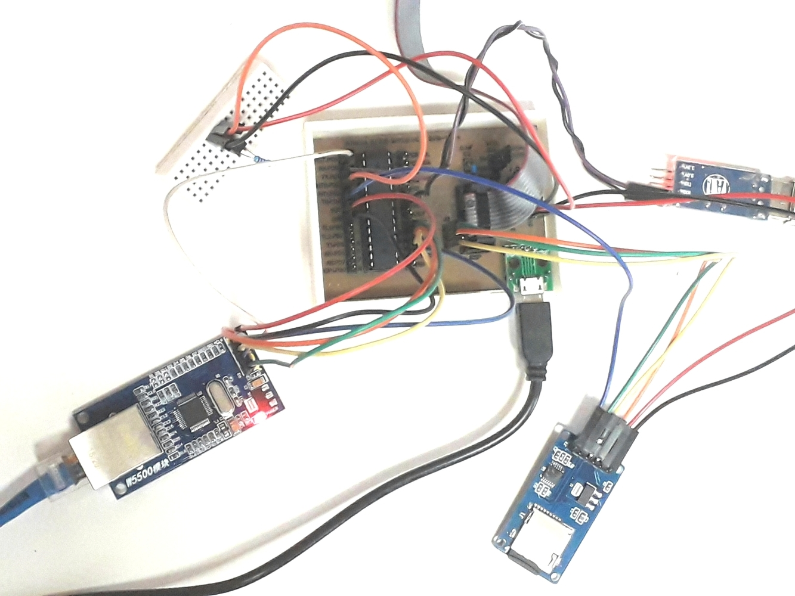

# iot-temp-sensors-sd-card

atmega328 + onewire ds18b20 + ethernet w5500 + sd card
this is a variant of [this project](https://github.com/devel0/iot-temp-sensors) with sd card support

- general wiring colors used
  - black GND, red 5V/3V3
  - orange MISO ( slave transmit to master )
  - yellow MOSI ( master transmit to slave )
  - green SPI CLOCK
  - blue SPI slave chip select
  - violet serial transmission line ( debug )

- [schematics](https://easyeda.com/lorenzo.delana/iot-temp-sensors-sd-card)

- notes about [sd card spi](https://github.com/devel0/iot-atmega-bare/tree/2a97d018bbcc610b511446b6d2a4c0ba3d237dcf#notes-about-spi)

## features

- atmega manage only webapi
- html pages and javascripts moved to sd card; [index.html](sdcard/index.html) and [app.js](sdcard/app.js) need to be copied to SD card

## install

- tune [variables](https://github.com/devel0/iot-temp-sensors-sd-card/blob/a068eca9ee6f2653f08d43562722f0427cce174c/temp-sensors-sd-card/temp-sensors.ino#L3-L28) in particular remember to disable [ENABLE_CORS](https://github.com/devel0/iot-temp-sensors-sd-card/blob/a068eca9ee6f2653f08d43562722f0427cce174c/temp-sensors-sd-card/temp-sensors.ino#L3-L28)
- set temperature sensors description into [app.js](https://github.com/devel0/iot-temp-sensors-sd-card/blob/a068eca9ee6f2653f08d43562722f0427cce174c/sdcard/app.js#L9) sensorDesc
- disable [debug mode](https://github.com/devel0/iot-temp-sensors-sd-card/blob/a068eca9ee6f2653f08d43562722f0427cce174c/sdcard/app.js#L15)

## debugging

- program atmega and make it running within its webapi ( say at 10.10.4.110 for example )
- open vscode and drag into index.html and app.js ( you may need to download a copy of jquery and open it to enable intellisense of $. functions )
- enable [debug mode](https://github.com/devel0/iot-temp-sensors-sd-card/blob/a068eca9ee6f2653f08d43562722f0427cce174c/sdcard/app.js#L15)
- set [baseurl](https://github.com/devel0/iot-temp-sensors-sd-card/blob/a068eca9ee6f2653f08d43562722f0427cce174c/sdcard/app.js#L20) to atmega eth address
- [enable CORS](https://github.com/devel0/iot-temp-sensors-sd-card/blob/a068eca9ee6f2653f08d43562722f0427cce174c/temp-sensors-sd-card/temp-sensors.ino#L3-L28)

## memory considerations

using w5500 save up to about 5.5k flash bytes

## roadmap

- currently sd card used to discharge flash from weight of html/javascript and at the same time to allow easy debugging/editing from pc ; subsequently sd card will be used to log data so that the index.htm can contains a graph of temperatures history

- this version uses W5500 but simply commenting Ethernet.h and uncomment [UIPEthernet.h](https://github.com/devel0/iot-temp-sensors-sd-card/blob/a068eca9ee6f2653f08d43562722f0427cce174c/temp-sensors-sd-card/temp-sensors.ino#L40) allow to run through enc28j60 ; to make it run in the 32K m328 flash would need to [disable UDP]() that should save 5k flash while another possible 1.2k save could from [this pr](https://github.com/UIPEthernet/UIPEthernet/pull/47)
